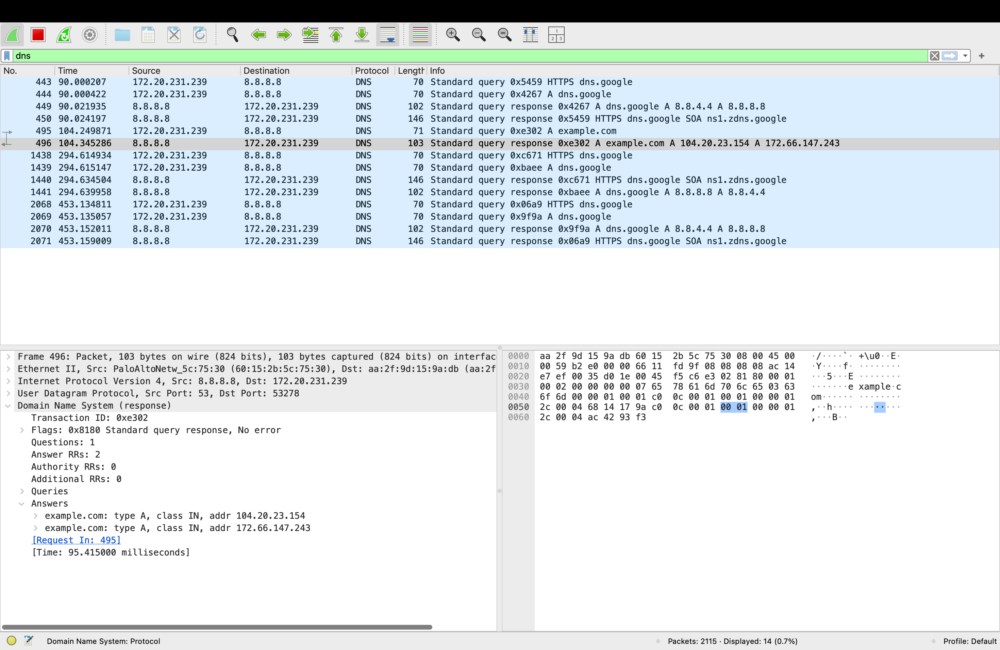
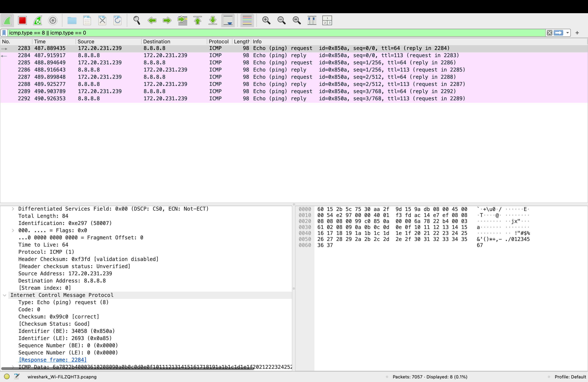
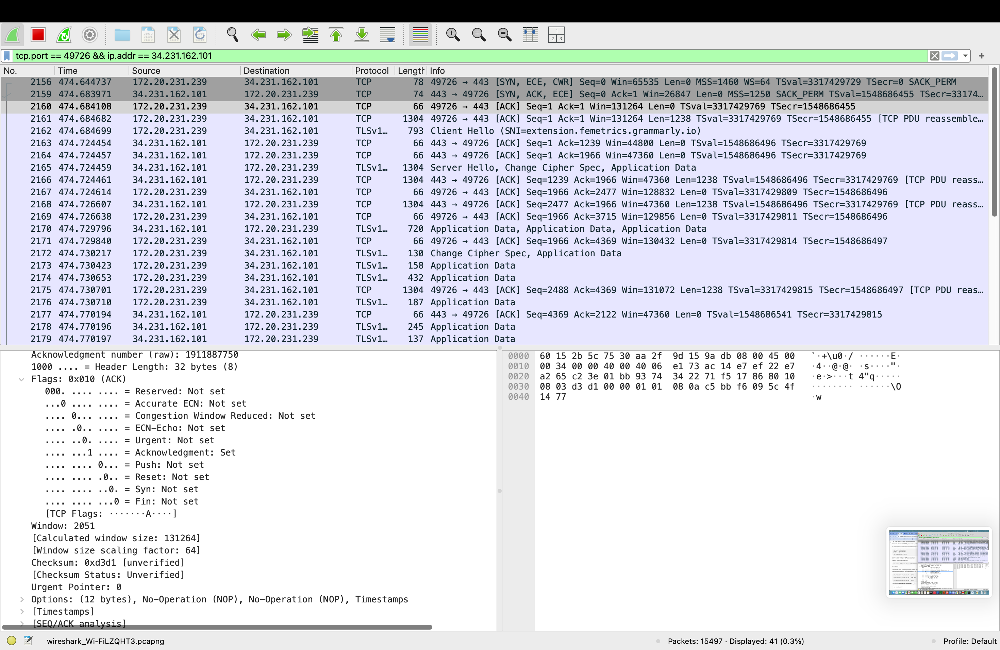
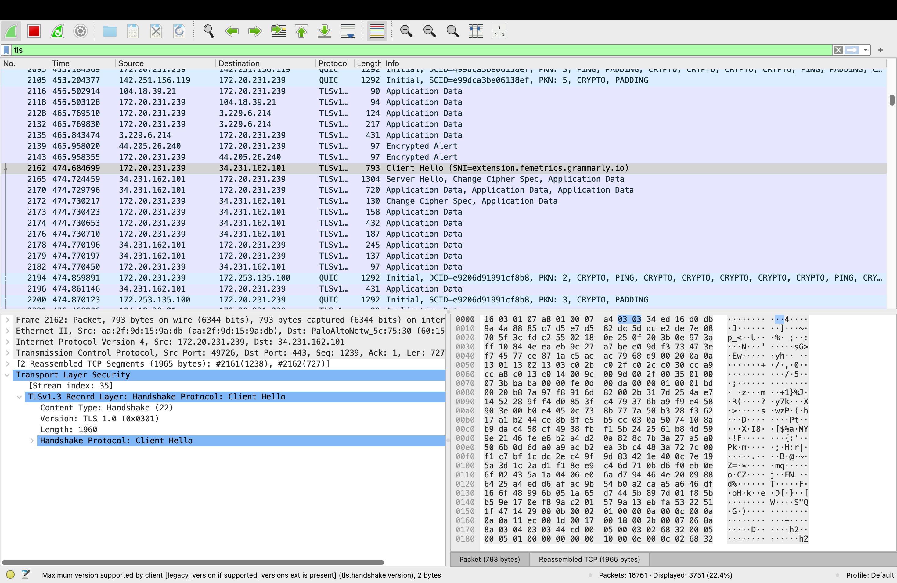

# Wireshark Network Traffic Analysis

## Project Overview

This project was created to practice basic network traffic analysis using Wireshark. I captured traffic from my Mac and examined several common networking protocols to better understand how devices communicate across a network.

## Tools Used

- Wireshark
- macOS
- Terminal

## Concepts Practiced

- DNS
- IPv4
- ICMP
- TCP
- TLS
- Network packet analysis

## DNS Analysis

I used `nslookup example.com` to generate a DNS request and captured the traffic in Wireshark.

I identified a DNS query sent from my computer to the DNS server at `8.8.8.8`. The query requested an A record for `example.com`, which is used to obtain an IPv4 address.

The DNS server responded with IPv4 addresses associated with the domain.

## ICMP Ping Analysis

I used the `ping` command to send four ICMP Echo Requests to `8.8.8.8`.

In Wireshark, I identified the Echo Requests sent from my computer and the corresponding Echo Replies returned by the destination.

This helped me understand how ICMP can be used to test whether another host is reachable.

## TCP Three-Way Handshake

I identified a TCP connection and examined the three packets used to establish the connection:

1. SYN
2. SYN-ACK
3. ACK

The client first requested a connection using SYN. The server responded with SYN-ACK, and the client completed the handshake with ACK.

## TLS Analysis

I examined TLS traffic and identified a Client Hello, Server Hello, and encrypted Application Data.

This demonstrated how TLS establishes an encrypted session after a TCP connection has been created. Wireshark could identify that application data was being exchanged, but the contents were encrypted.

## What I Learned

This project helped me understand how networking concepts appear in real network traffic instead of only learning them theoretically.

I gained hands-on experience using Wireshark display filters, inspecting individual packets, identifying source and destination IP addresses, and analyzing DNS, ICMP, TCP, and TLS traffic.
